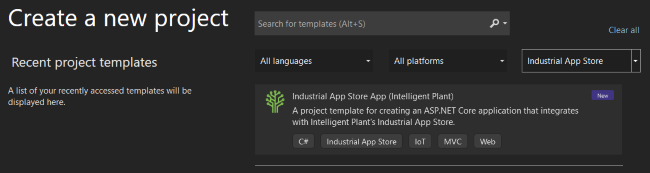
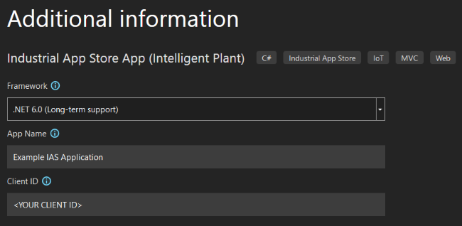

# IntelligentPlant.IndustrialAppStore.Templates

This project defines [Industrial App Store](https://appstore.intelligentplant.com) templates for Visual Studio 2022 and the [dotnet new](https://docs.microsoft.com/en-us/dotnet/core/tools/dotnet-new) command.

> Unlike previous versions of Visual Studio, templates installed by `dotnet new` command are also visible in Visual Studio 2022.


# Installing Templates

You can install the [Industrial App Store templates](https://www.nuget.org/packages/IntelligentPlant.IndustrialAppStore.Templates) for `dotnet new` as follows:

__Latest Version:__

```
dotnet new --install IntelligentPlant.IndustrialAppStore.Templates
```

__Specific Version:__

```
dotnet new --install IntelligentPlant.IndustrialAppStore.Templates::1.2.3
```

__From Source:__

Alternatively, you can install the template from source by checking out this repository, building the solution, navigating to the [root templates folder](/src/IntelligentPlant.IndustrialAppStore.Templates) from the command line, and running the following command:

```
dotnet new --install .\
```

Note that, when installing the template from source, the reference to the `IntelligentPlant.IndustrialAppStore.Authentication` NuGet package in projects generated using the template may use an incorrect version. You will have to update generated projects to use the correct package version, or replace the package reference with a project reference to the `IntelligentPlant.IndustrialAppStore.Authentication` project in this repository.


# Creating an App using a Template

Before creating a new app, you should [create an app registration](https://appstore.intelligentplant.com/Developer/AddApplication) on the Industrial App Store. 


## Creating an App using Visual Studio 2022

Once the template package has been installed, search for `Industrial App Store` in Visual Studio's "Create a new project" window or choose `Industrial App Store` from the project types list:



After selecting the template, you will be prompted to select a project location and then optionally enter some details about your app that will be applied to the template:




## Creating an App using `dotnet new`

After your app registration has been completed, you can create a new C# project using the `dotnet new` command from the command line as follows:

```
mkdir MyNewApp.Web
cd MyNewApp.Web
dotnet new iasmvc
```

This will create a new ASP.NET Core MVC application that is pre-configured to use the Industrial App Store for authentication. The `README.md` file for the new project provides additional instructions for completing the setup.

You can also open the project in Visual Studio by double clicking it.


### Specifying Project Parameters

When creating the project, you can provide several command line parameters to pre-populate items such as the display name used in the app, and the client ID used for authentication. Run `dotnet new iasmvc --help` to see all of the available options. 

Examples:

```
# Sets the app display name and client ID

dotnet new iasmvc --app-name "My First App" --client-id "abcdef0123456789"
```

```
# Specifies the local HTTPS port to use instead of randomly choosing a port.

dotnet new iasmvc --port 43789
```

Note that it is not possible to specify the client secret when creating the project; the `README.md` file created by the template in the project folder contains instructions for setting the client secret.


# Writing an On-Premises App

The `README.md` file created by the template in the project folder contains instructions for writing an app that can use an on-premises Data Core API instance instead of (or in addition to) the Industrial App Store, as well as highlighting differences in behaviour between Industrial App Store and on-premises apps. 

You can view the templated version of the templates `README.md` file [here](./templates/iasmvc/README.md). Note that the templated version of the file contains placeholders that are replaced by the `dotnet new` command when you create a project from the template!

> If you want to develop an on-premises app (or an app that can be deployed both on-premises and through the Industrial App Store), please [contact Intelligent Plant](https://www.intelligentplant.com/contact-us) to request an on-premises Data Core API installation.
